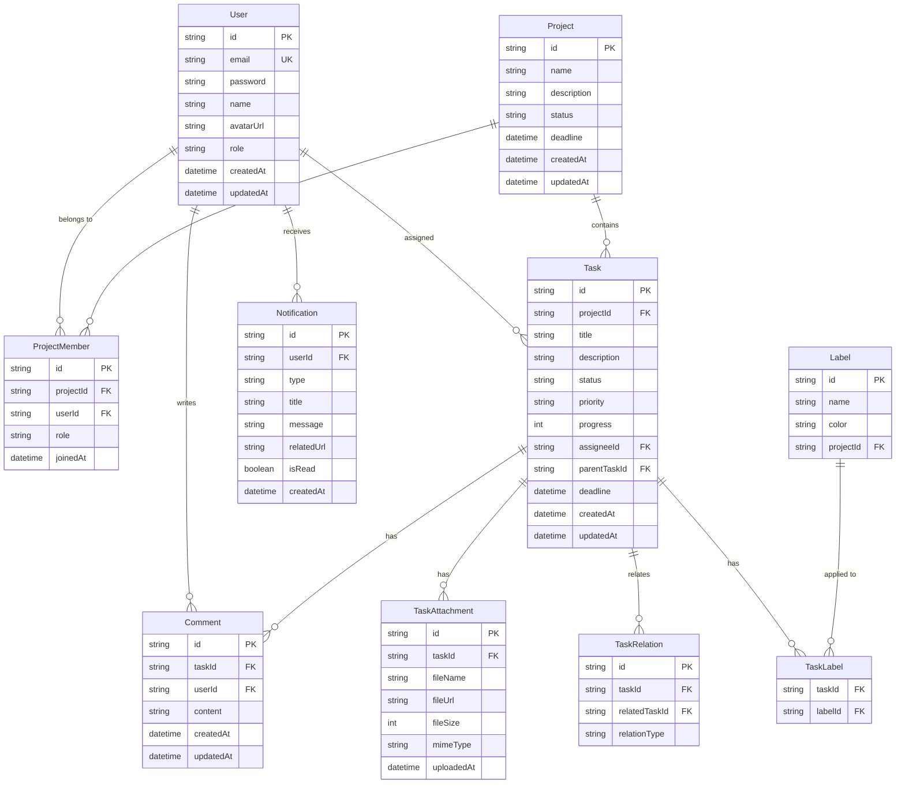
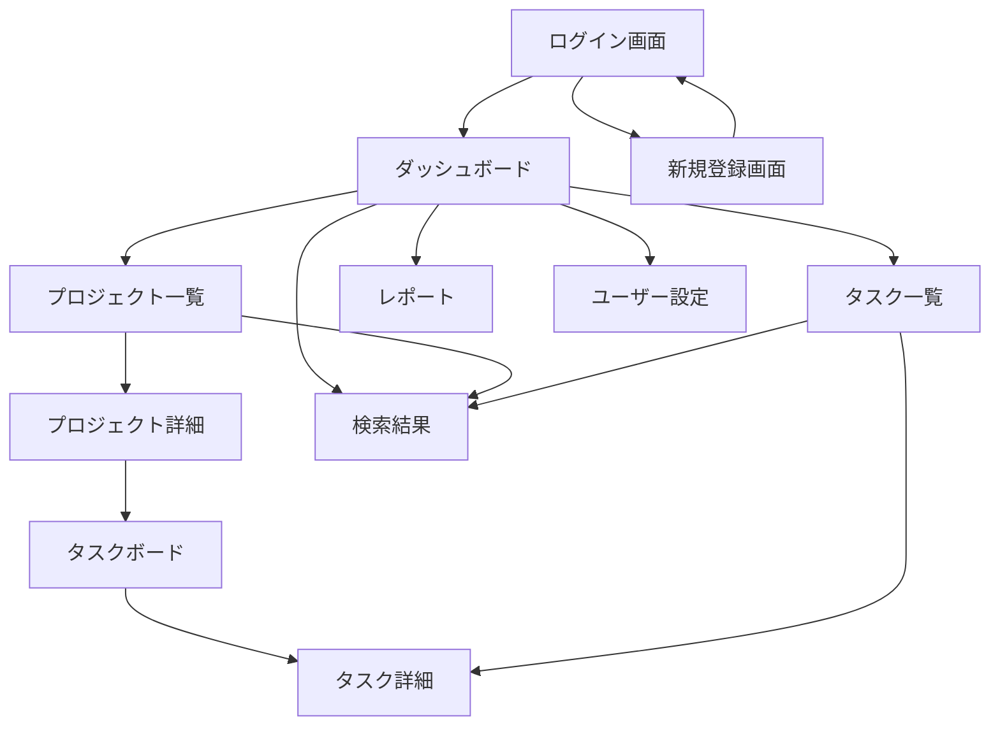
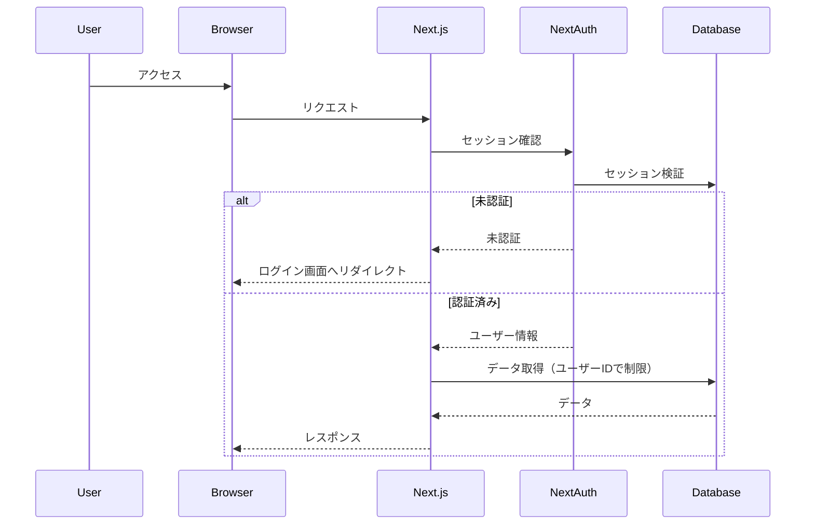

# 基本設計書 - TaskFlow

## 1. システムアーキテクチャ

### 1.1 全体構成

```
┌─────────────────────────────────────────────────────────┐
│                    Client Browser                        │
│  ┌─────────────────────────────────────────────────┐   │
│  │            Next.js App (Vercel Edge)             │   │
│  │  ┌───────────────┬───────────────────────────┐  │   │
│  │  │Server Components│   Client Components      │  │   │
│  │  │               │   - Event Handlers        │  │   │
│  │  │  - Data Fetch │   - Interactive UI       │  │   │
│  │  │  - Rendering  │   - Browser APIs         │  │   │
│  │  └───────────────┴───────────────────────────┘  │   │
│  └─────────────────────────────────────────────────┘   │
└─────────────────────────────────────────────────────────┘
                              │
                              ▼
┌─────────────────────────────────────────────────────────┐
│                    Next.js Server                        │
│  ┌─────────────────────────────────────────────────┐   │
│  │              App Router (app/)                   │   │
│  │  ┌──────────┬──────────┬───────────────────┐   │   │
│  │  │  Routes  │ Layouts  │  Server Actions   │   │   │
│  │  └──────────┴──────────┴───────────────────┘   │   │
│  │                                                  │   │
│  │  ┌────────────────────────────────────────┐    │   │
│  │  │         Middleware Layer                │    │   │
│  │  │  - Authentication (NextAuth.js)         │    │   │
│  │  │  - Rate Limiting                        │    │   │
│  │  │  - Request Validation                   │    │   │
│  │  └────────────────────────────────────────┘    │   │
│  └─────────────────────────────────────────────────┘   │
└─────────────────────────────────────────────────────────┘
                              │
                              ▼
┌─────────────────────────────────────────────────────────┐
│                   Data Layer                             │
│  ┌─────────────────────────────────────────────────┐   │
│  │              Prisma ORM                          │   │
│  │  - Type-safe database queries                    │   │
│  │  - Migration management                          │   │
│  └─────────────────────────────────────────────────┘   │
│                          │                               │
│                          ▼                               │
│  ┌─────────────────────────────────────────────────┐   │
│  │            PostgreSQL Database                    │   │
│  │  - User data                                     │   │
│  │  - Project/Task data                             │   │
│  │  - File metadata                                 │   │
│  └─────────────────────────────────────────────────┘   │
└─────────────────────────────────────────────────────────┘
                              │
                              ▼
┌─────────────────────────────────────────────────────────┐
│              External Services                           │
│  - Vercel Blob Storage (File uploads)                   │
│  - SendGrid (Email notifications)                       │
│  - Redis (Cache & Session storage)                      │
└─────────────────────────────────────────────────────────┘
```

### 1.2 ディレクトリ構造

```
taskflow/
├── app/                          # Next.js App Router
│   ├── (auth)/                  # 認証関連のルートグループ
│   │   ├── login/
│   │   ├── register/
│   │   └── layout.tsx
│   ├── (dashboard)/             # ダッシュボードルートグループ
│   │   ├── projects/
│   │   │   ├── [projectId]/
│   │   │   │   ├── tasks/
│   │   │   │   ├── settings/
│   │   │   │   └── page.tsx
│   │   │   └── page.tsx
│   │   ├── tasks/
│   │   ├── reports/
│   │   └── layout.tsx
│   ├── api/                     # API Routes (必要最小限)
│   │   └── auth/[...nextauth]/
│   ├── layout.tsx               # Root layout
│   └── page.tsx                 # Home page
├── components/
│   ├── server/                  # Server Components
│   │   ├── projects/
│   │   │   ├── ProjectList.tsx
│   │   │   └── ProjectCard.tsx
│   │   ├── tasks/
│   │   │   ├── TaskList.tsx
│   │   │   ├── TaskCard.tsx
│   │   │   └── KanbanBoard.tsx
│   │   └── common/
│   │       ├── Header.tsx
│   │       └── Sidebar.tsx
│   ├── client/                  # Client Components
│   │   ├── forms/
│   │   │   ├── TaskForm.tsx
│   │   │   └── ProjectForm.tsx
│   │   ├── interactive/
│   │   │   ├── DragDropArea.tsx
│   │   │   └── SearchBar.tsx
│   │   └── ui/
│   │       ├── Button.tsx
│   │       ├── Modal.tsx
│   │       └── Toast.tsx
│   └── shared/                  # Shared Components
│       └── providers/
│           └── ThemeProvider.tsx
├── lib/
│   ├── actions/                 # Server Actions
│   │   ├── projects.ts
│   │   ├── tasks.ts
│   │   └── users.ts
│   ├── data/                    # Data fetching層
│   │   ├── projects.ts
│   │   ├── tasks.ts
│   │   └── users.ts
│   ├── db/
│   │   ├── prisma.ts           # Prisma client
│   │   └── schema.prisma       # Database schema
│   ├── auth/
│   │   └── config.ts           # NextAuth設定
│   ├── cache/
│   │   └── config.ts           # キャッシュ設定
│   └── utils/
│       ├── validation.ts
│       └── format.ts
├── types/
│   ├── database.ts              # DB型定義
│   ├── api.ts                   # API型定義
│   └── components.ts            # コンポーネント型定義
├── styles/
│   └── globals.css              # Tailwind CSS
├── public/
│   └── images/
└── tests/
    ├── unit/
    ├── integration/
    └── e2e/
```

### 1.3 レンダリング戦略

| ページ/コンポーネント | レンダリング方式 | キャッシュ戦略 | 理由 |
|----------------------|-----------------|---------------|------|
| ホームページ | Static | 1時間 | 更新頻度が低い |
| プロジェクト一覧 | Dynamic + Streaming | 5分 | ユーザー固有データ |
| タスク詳細 | Dynamic | なし | リアルタイム性重視 |
| カンバンボード | Hybrid (Server + Client) | なし | ドラッグ&ドロップ対応 |
| レポート | Static + ISR | 1日 | 定期更新 |
| ユーザープロフィール | Dynamic | 30分 | 個人データ |

## 2. データモデル設計

### 2.1 ER図



### 2.2 データアクセスパターン

```typescript
// データフェッチ層の例（/lib/data/tasks.ts）
import "server-only";
import { prisma } from "@/lib/db/prisma";
import { cache } from "react";
import { unstable_cache } from "next/cache";

// 個別タスク取得（キャッシュあり）
export const getTask = unstable_cache(
  async (taskId: string) => {
    return prisma.task.findUnique({
      where: { id: taskId },
      include: {
        assignee: true,
        project: true,
        comments: {
          include: { user: true },
          orderBy: { createdAt: "desc" },
        },
        attachments: true,
        labels: {
          include: { label: true },
        },
      },
    });
  },
  ["task-detail"],
  {
    revalidate: 60, // 1分キャッシュ
    tags: ["task"],
  }
);

// プロジェクトのタスク一覧取得（並列フェッチ対応）
export const getProjectTasks = cache(async (projectId: string) => {
  const [tasks, stats] = await Promise.all([
    prisma.task.findMany({
      where: { projectId },
      include: {
        assignee: true,
        labels: { include: { label: true } },
      },
      orderBy: { createdAt: "desc" },
    }),
    prisma.task.groupBy({
      by: ["status"],
      where: { projectId },
      _count: true,
    }),
  ]);
  
  return { tasks, stats };
});

// Preloadパターンの実装
export const preloadProjectTasks = (projectId: string) => {
  void getProjectTasks(projectId);
};
```

## 3. 画面設計

### 3.1 画面一覧

| 画面ID | 画面名 | パス | 説明 | Component Type |
|--------|--------|------|------|----------------|
| SC-001 | ログイン | /login | ユーザー認証 | Client (Form) |
| SC-002 | 新規登録 | /register | アカウント作成 | Client (Form) |
| SC-003 | ダッシュボード | /dashboard | 概要表示 | Server |
| SC-004 | プロジェクト一覧 | /projects | プロジェクト管理 | Server + Client (Filter) |
| SC-005 | プロジェクト詳細 | /projects/[id] | プロジェクト情報 | Server |
| SC-006 | タスクボード | /projects/[id]/tasks | カンバンボード | Server + Client (DnD) |
| SC-007 | タスク詳細 | /tasks/[id] | タスク情報編集 | Server + Client (Form) |
| SC-008 | レポート | /reports | 統計情報 | Server |
| SC-009 | ユーザー設定 | /settings | プロフィール編集 | Server + Client (Form) |
| SC-010 | 検索結果 | /search | 検索結果表示 | Server |

### 3.2 画面遷移図



### 3.3 レイアウト構成

```
┌──────────────────────────────────────────────────────┐
│                    Header (Server)                    │
│  Logo | Navigation | Search | Notifications | Profile │
├────────┬─────────────────────────────────────────────┤
│        │                                              │
│        │              Main Content Area               │
│ Sidebar│                                              │
│        │   ┌────────────────────────────────────┐    │
│(Server)│   │     Dynamic Content (Per Page)     │    │
│        │   │                                     │    │
│ - Home │   │  Server Components for data fetch  │    │
│ - Proj │   │  Client Components for interaction │    │
│ - Tasks│   │                                     │    │
│ - Report   └────────────────────────────────────┘    │
│        │                                              │
└────────┴─────────────────────────────────────────────┘
```

## 4. API設計

### 4.1 Server Actions定義

```typescript
// /lib/actions/tasks.ts
"use server";

import { z } from "zod";
import { revalidatePath, revalidateTag } from "next/cache";
import { prisma } from "@/lib/db/prisma";

// バリデーションスキーマ
const CreateTaskSchema = z.object({
  title: z.string().min(1).max(200),
  description: z.string().max(2000).optional(),
  projectId: z.string().uuid(),
  assigneeId: z.string().uuid().optional(),
  priority: z.enum(["low", "medium", "high"]),
  deadline: z.string().datetime().optional(),
});

// タスク作成アクション
export async function createTask(formData: FormData) {
  const validatedFields = CreateTaskSchema.safeParse({
    title: formData.get("title"),
    description: formData.get("description"),
    projectId: formData.get("projectId"),
    assigneeId: formData.get("assigneeId"),
    priority: formData.get("priority"),
    deadline: formData.get("deadline"),
  });

  if (!validatedFields.success) {
    return {
      success: false,
      errors: validatedFields.error.flatten().fieldErrors,
    };
  }

  try {
    const task = await prisma.task.create({
      data: {
        ...validatedFields.data,
        status: "todo",
        progress: 0,
      },
    });

    // キャッシュ無効化
    revalidateTag("task");
    revalidatePath(`/projects/${validatedFields.data.projectId}`);

    return { success: true, data: task };
  } catch (error) {
    return { success: false, error: "Failed to create task" };
  }
}

// タスクステータス更新アクション
export async function updateTaskStatus(
  taskId: string,
  status: string,
  position?: number
) {
  try {
    const task = await prisma.task.update({
      where: { id: taskId },
      data: { 
        status,
        position,
        updatedAt: new Date(),
      },
    });

    // 関連キャッシュの無効化
    revalidateTag("task");
    revalidateTag(`task-${taskId}`);
    
    return { success: true, data: task };
  } catch (error) {
    return { success: false, error: "Failed to update task status" };
  }
}
```

### 4.2 データフェッチ戦略

| データ種別 | フェッチ場所 | キャッシュ | 並列化 |
|-----------|------------|----------|--------|
| ユーザー情報 | Layout | 30分 | - |
| プロジェクト一覧 | Page | 5分 | ✓ |
| タスク一覧 | Component | なし | ✓ |
| コメント | Component | 1分 | ✓ |
| 通知 | Client | なし | - |
| ファイル | On-demand | 1時間 | - |

## 5. コンポーネント設計

### 5.1 コンポーネント階層

```
<ProjectLayout>                    // Server Component
  <ProjectHeader />                 // Server Component
    <ProjectTitle />                // Server Component
    <ProjectActions />              // Client Component (buttons)
  
  <Suspense fallback={<TaskBoardSkeleton />}>
    <TaskBoard>                     // Server Component
      <TaskColumnList>              // Server Component
        <TaskColumn>                // Server Component
          <TaskCard>                // Server Component
            <TaskDragWrapper>       // Client Component (DnD)
              <TaskContent />       // Server Component
              <TaskActions />       // Client Component
            </TaskDragWrapper>
          </TaskCard>
        </TaskColumn>
      </TaskColumnList>
    </TaskBoard>
  </Suspense>
  
  <Suspense fallback={<StatsSkeleton />}>
    <ProjectStats />                // Server Component (parallel fetch)
  </Suspense>
</ProjectLayout>
```

### 5.2 Compositionパターン適用例

```typescript
// Server Component - データ取得
// /components/server/tasks/TaskList.tsx
import { Suspense } from "react";
import { getProjectTasks } from "@/lib/data/tasks";
import { TaskListPresentation } from "@/components/client/tasks/TaskListPresentation";

export async function TaskList({ projectId }: { projectId: string }) {
  const { tasks, stats } = await getProjectTasks(projectId);
  
  return (
    <div className="grid gap-4">
      <TaskListPresentation tasks={tasks} stats={stats} />
    </div>
  );
}

// Client Component - プレゼンテーション
// /components/client/tasks/TaskListPresentation.tsx
"use client";

import { Task } from "@/types/database";
import { TaskCard } from "./TaskCard";

interface Props {
  tasks: Task[];
  stats: Record<string, number>;
}

export function TaskListPresentation({ tasks, stats }: Props) {
  // インタラクティブな機能のみClient Componentで実装
  const [filter, setFilter] = useState("all");
  
  const filteredTasks = tasks.filter(task => 
    filter === "all" || task.status === filter
  );
  
  return (
    <>
      <FilterBar onFilterChange={setFilter} stats={stats} />
      <div className="space-y-2">
        {filteredTasks.map(task => (
          <TaskCard key={task.id} task={task} />
        ))}
      </div>
    </>
  );
}
```

## 6. セキュリティ設計

### 6.1 認証・認可フロー



### 6.2 セキュリティ実装方針

| 対策項目 | 実装方法 |
|---------|---------|
| 認証 | NextAuth.js with JWT |
| セッション管理 | Secure Cookie + Redis |
| CSRF対策 | Next.js built-in |
| XSS対策 | React自動エスケープ + CSP |
| SQLインジェクション | Prisma ORM |
| 入力検証 | Zod schema validation |
| ファイルアップロード | Vercel Blob with validation |
| Rate Limiting | Middleware実装 |

## 7. パフォーマンス設計

### 7.1 最適化戦略

```typescript
// 並列データフェッチの実装例
// /app/(dashboard)/projects/[projectId]/page.tsx

import { Suspense } from "react";
import { preloadProjectTasks } from "@/lib/data/tasks";
import { ProjectHeader } from "@/components/server/projects/ProjectHeader";
import { TaskBoard } from "@/components/server/tasks/TaskBoard";
import { ProjectStats } from "@/components/server/projects/ProjectStats";

export default async function ProjectPage({ 
  params 
}: { 
  params: { projectId: string } 
}) {
  // Preloadパターン - データフェッチを先行開始
  preloadProjectTasks(params.projectId);
  
  return (
    <div className="container mx-auto p-4">
      {/* ヘッダーは独立してレンダリング */}
      <ProjectHeader projectId={params.projectId} />
      
      {/* タスクボードとスタッツを並列レンダリング */}
      <div className="grid grid-cols-1 lg:grid-cols-3 gap-6 mt-6">
        <div className="lg:col-span-2">
          <Suspense fallback={<TaskBoardSkeleton />}>
            <TaskBoard projectId={params.projectId} />
          </Suspense>
        </div>
        
        <div>
          <Suspense fallback={<StatsSkeleton />}>
            <ProjectStats projectId={params.projectId} />
          </Suspense>
        </div>
      </div>
    </div>
  );
}
```

### 7.2 キャッシュ戦略

| キャッシュレベル | 対象 | TTL | 無効化トリガー |
|-----------------|------|-----|---------------|
| Browser Cache | Static Assets | 1年 | デプロイ時 |
| CDN Cache | 静的ページ | 1時間 | revalidate |
| Data Cache | fetch結果 | 5分 | revalidateTag |
| Full Route Cache | 静的ルート | なし | オンデマンド |
| Request Memoization | 同一リクエスト | リクエスト中 | - |

## 8. エラー処理設計

### 8.1 エラーバウンダリ構成

```typescript
// /app/(dashboard)/error.tsx
"use client";

export default function Error({
  error,
  reset,
}: {
  error: Error & { digest?: string };
  reset: () => void;
}) {
  return (
    <div className="flex flex-col items-center justify-center min-h-[400px]">
      <h2 className="text-2xl font-bold mb-4">エラーが発生しました</h2>
      <p className="text-gray-600 mb-4">{error.message}</p>
      <button
        onClick={reset}
        className="px-4 py-2 bg-blue-500 text-white rounded hover:bg-blue-600"
      >
        再試行
      </button>
    </div>
  );
}
```

## 9. テスト設計

### 9.1 テスト戦略

| テスト種別 | ツール | カバレッジ目標 | 実行タイミング |
|-----------|--------|--------------|---------------|
| Unit Test | Jest + React Testing Library | 80% | Pre-commit |
| Integration Test | Jest | 60% | Pre-push |
| E2E Test | Playwright | Critical Path | CI/CD |
| Visual Regression | Chromatic | UI Components | PR |
| Performance | Lighthouse CI | Score 90+ | Daily |

## 10. 監視・運用設計

### 10.1 監視項目

- **アプリケーション監視**: Vercel Analytics
- **エラー監視**: Sentry
- **パフォーマンス監視**: Web Vitals
- **アップタイム監視**: Uptime Robot
- **ログ管理**: Vercel Logs

### 10.2 アラート設定

| 項目 | 閾値 | 通知先 |
|------|------|--------|
| エラー率 | > 1% | Slack |
| レスポンスタイム | > 3秒 | Email |
| メモリ使用率 | > 80% | Slack |
| DB接続エラー | 発生時 | PagerDuty |
